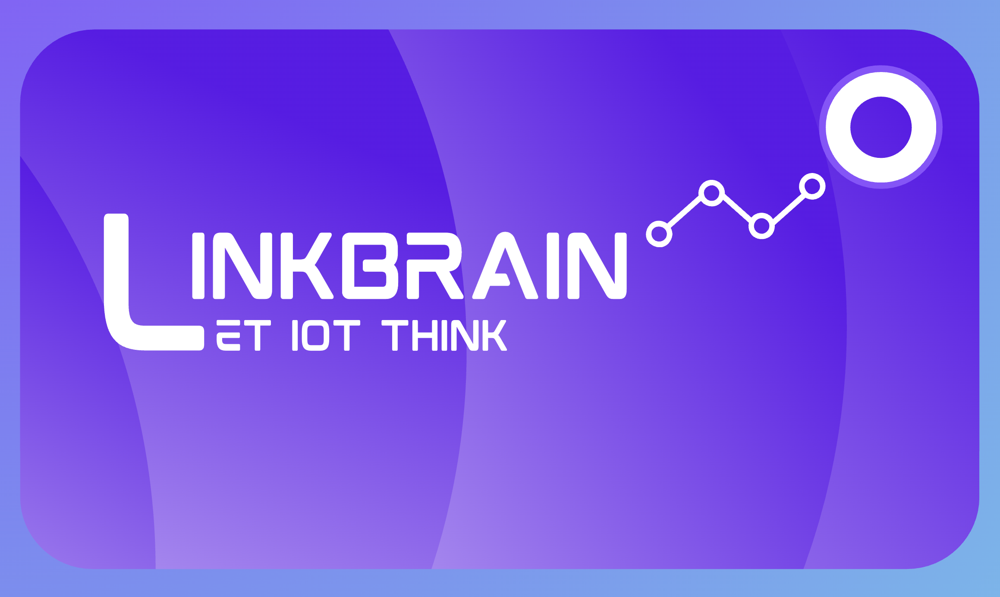

<div align="center">

<table>
  <tr>
    <td align="center">
      
    </td>
    <td valign="middle" align="left">
      <h2>LinkBrain</h2>
      <div>ESP32 AI-powered smart home system SDK</div>
      <br>
      <div>
        <p align="center">
          
          
          
        </p>
      </div>
    </td>
  </tr>
</table>

</div>


LinkBrain is a clean, extensible Python library for controlling ESP32-based home automation devices. This SDK provides a hardware control layer designed to be used by higher-level applications (mobile apps, web apps, desktop apps).

---

## 🎯 Purpose

LinkBrain is a **hardware control SDK**, not an application. It abstracts:
- ESP32 connectivity (Bluetooth, Wi-Fi)
- Command formatting and dispatch
- Device control (GPIO-based home devices)

Applications should only need to call high-level APIs like `fan.on()` or `light.off()`.

---

## 🏗️ Architecture

### Core Design Principles

1. **Single Controller Pattern**: `ESP32Controller` is the only object that manages connectivity
2. **Device Abstraction**: Devices never directly manage Bluetooth or Wi-Fi
3. **Swappable Connectivity**: Easy to switch between Bluetooth ↔ Wi-Fi
4. **Clean OOP Boundaries**: Clear separation of concerns using composition

### Package Structure

```
LinkBrain/
├── core/
│   ├── controller.py        # Main ESP32 controller (single entry point)
│   ├── command.py           # Command abstraction / protocol
│   └── exceptions.py        # Custom SDK exceptions
├── connectivity/
│   ├── base.py              # Base connectivity interface
│   ├── bluetooth.py         # Bluetooth implementation
│   └── wifi.py              # Wi-Fi implementation
├── devices/
│   ├── base.py              # Abstract device class
│   ├── fan.py               # Fan device
│   ├── light.py             # Light device
│   ├── door.py              # Door controller
│   ├── window.py            # Window controller
│   └── energy_monitor.py    # Energy monitor
└── utils/
    └── logger.py            # Logging utilities
```

### Architecture Flow

```
Application Layer
      ↓
Device Objects (Fan, Light, Door, etc.)
      ↓
ESP32Controller (manages connectivity)
      ↓
Connectivity Layer (Bluetooth or Wi-Fi)
      ↓
ESP32 Hardware
```

---

## 🚀 Quick Start

### Installation

```bash
# Clone or copy the LinkBrain package into your project
# No pip package yet - v0.1.0 is file-based

# Ensure you have Python 3.8+
python --version
```

### Basic Usage

```python
from LinkBrain import ESP32Controller
from LinkBrain.devices import Fan, Light, Door

# Initialize controller with Bluetooth
controller = ESP32Controller(
    mode="bluetooth",
    device_address="AA:BB:CC:DD:EE:FF"
)

# Connect to ESP32
controller.connect()

# Create devices
fan = Fan(controller, pin=12, name="Living Room Fan")
light = Light(controller, pin=14, name="Bedroom Light")
door = Door(controller, pin=16, name="Front Door")

# Control devices
fan.on()
light.off()
door.unlock()

# Check status
print(fan.status())
# Output: {'name': 'Living Room Fan', 'pin': 12, 'state': 'on', 'type': 'fan'}

# Cleanup
controller.disconnect()
```

### Using Context Manager

```python
from LinkBrain import ESP32Controller
from LinkBrain.devices import Light

with ESP32Controller(mode="wifi", device_address="192.168.1.100") as controller:
    light = Light(controller, pin=14)
    light.on()
    # Automatically disconnects when exiting context
```

---

## 📱 Supported Devices

### Fan
Controls fans via relay or transistor.

```python
fan = Fan(controller, pin=12)
fan.on()
fan.off()
fan.toggle()
status = fan.status()
```

### Light
Controls lights (LEDs, bulbs, etc.).

```python
light = Light(controller, pin=14)
light.on()
light.off()
light.toggle()
```

### Door
Controls smart locks, garage doors, automatic doors.

```python
door = Door(controller, pin=16)
door.lock()
door.unlock()
door.toggle()
```

### Window
Controls automated window blinds, shutters, or actuators.

```python
window = Window(controller, pin=18)
window.open()
window.close()
window.toggle()
```

### Energy Monitor
Monitors electrical consumption via current/voltage sensors.

```python
monitor = EnergyMonitor(controller, pin=34, voltage=220.0)
readings = monitor.get_readings()
print(f"Power: {readings['power_watts']}W")
```

---

## 🔌 Connectivity Modes

### Bluetooth

```python
controller = ESP32Controller(
    mode="bluetooth",
    device_address="AA:BB:CC:DD:EE:FF",
    timeout=5.0
)
```

### Wi-Fi

```python
controller = ESP32Controller(
    mode="wifi",
    device_address="192.168.1.100",
    port=8080,
    timeout=5.0
)
```

---

## ⚙️ Configuration

### Valid GPIO Pins
- **Digital I/O**: 0-39 (most pins)
- **ADC-capable** (for EnergyMonitor): 32, 33, 34, 35, 36, 39

### Logging

```python
import logging
from LinkBrain.utils.logger import get_logger

# Enable debug logging
logger = get_logger(__name__, level=logging.DEBUG)
```

---

## 🛠️ Extending the SDK

### Adding a New Device

1. Create a new file in `LinkBrain/devices/`
2. Inherit from `BaseDevice`
3. Implement required methods

```python
from LinkBrain.devices.base import BaseDevice

class Thermostat(BaseDevice):
    def set_temperature(self, temp: float):
        # Implementation
        pass
    
    def status(self):
        return {
            "name": self.name,
            "pin": self.pin,
            "type": "thermostat"
        }
```

### Adding a New Connectivity Mode

1. Create a new file in `LinkBrain/connectivity/`
2. Inherit from `BaseConnectivity`
3. Implement required methods
4. Register in `ESP32Controller._create_connectivity()`

---

## 🚫 What LinkBrain Does NOT Include

This is a **hardware control SDK**, not a full application. By design, it does NOT include:

- ❌ User interfaces (UI)
- ❌ Cloud connectivity
- ❌ Databases
- ❌ Authentication/authorization
- ❌ MQTT or message brokers
- ❌ OTA updates
- ❌ Async/await (kept simple for v0.1)

These features should be implemented in higher-level applications that use LinkBrain.

---

## 🔒 Error Handling

LinkBrain provides clear exception hierarchy:

```python
from LinkBrain.core.exceptions import (
    LinkBrainError,           # Base exception
    ConnectionError,       # Connection issues
    CommandError,          # Command execution failures
    DeviceError,           # Device operation failures
    TimeoutError,          # Operation timeouts
    InvalidPinError,       # Invalid GPIO pin
    UnsupportedModeError   # Unsupported connectivity mode
)

try:
    controller.connect()
except ConnectionError as e:
    print(f"Failed to connect: {e}")
```

---

## 📝 Protocol Format

LinkBrain uses a simple text-based protocol:

### Command Format
```
TYPE:PARAM1=VALUE1,PARAM2=VALUE2
```

Examples:
- `gpio_set:pin=12,value=1`
- `gpio_get:pin=14`
- `status`

### Response Format
```
OK:key1=value1,key2=value2
ERROR:error_message
```

---

## 🧪 Current Implementation Status

**v0.1.0** is a foundational release:

- ✅ Core architecture in place
- ✅ All device types implemented
- ✅ Both connectivity modes (Bluetooth, Wi-Fi) structured
- ⚠️ Connectivity uses **placeholder/mock implementations**
  - Real Bluetooth/Wi-Fi communication requires actual ESP32 hardware and firmware
  - Current implementation simulates responses for testing

### Next Steps for Production

1. Implement actual Bluetooth communication (PyBluez, bleak, etc.)
2. Implement actual Wi-Fi/TCP communication
3. Deploy corresponding firmware on ESP32
4. Add comprehensive error recovery
5. Performance optimization

---

## 🤝 Contributing

This is v0.1.0 - a starting point. Key areas for improvement:

1. Real hardware integration
2. More device types (sensors, motors, etc.)
3. Additional connectivity modes (Serial, LoRa, etc.)
4. Advanced features (device discovery, pairing, etc.)
5. Comprehensive test suite

---

## 📄 License

To be determined based on project requirements.

---

## 💡 Example Application Integration

```python
# Example: Simple CLI application using LinkBrain

from LinkBrain import ESP32Controller
from LinkBrain.devices import Fan, Light

def main():
    # Initialize
    controller = ESP32Controller(
        mode="wifi",
        device_address="192.168.1.100"
    )
    
    try:
        controller.connect()
        
        # Setup devices
        living_room_fan = Fan(controller, pin=12, name="Living Room Fan")
        bedroom_light = Light(controller, pin=14, name="Bedroom Light")
        
        # Application logic
        while True:
            command = input("Enter command (fan on/off, light on/off, quit): ")
            
            if command == "fan on":
                living_room_fan.on()
            elif command == "fan off":
                living_room_fan.off()
            elif command == "light on":
                bedroom_light.on()
            elif command == "light off":
                bedroom_light.off()
            elif command == "quit":
                break
    
    finally:
        controller.disconnect()

if __name__ == "__main__":
    main()
```

---

**LinkBrain** - Clean, Simple, Extensible ESP32 Control


I built a framework to let LLMs control ESP32s with proper parsing and safety. What features should I add next?
The "Show HN" (Hacker News): This is a tough crowd but highly influential. If they like your "Decoupled Architecture," it could go viral.
I've released the core architecture for LinkBrain. It's open-source because I want to see what devices you want to add. I've started with Lights; who wants to help me write the ClimateControl or Security modules?"
When an interviewer asks, "Tell me about a time you handled a difficult technical challenge," you won't talk about a LeetCode problem—you'll talk about solving race conditions in ESP32 hardware via an LLM parser